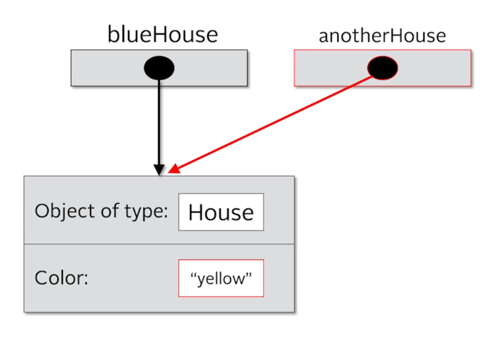

# Mastering-Java

I have created this repo in order to have an organize place to store 
some challenges and import Java fundamentals. It is worth mention that all this 
challenges are hosted on Udemy (Java 17 Masterclass: Start Coding in 2024, by Tim Buchalka), also I am taking notes from
a book call "CORE JAVA Volume I: Fundamentals, by Cay S. Hortsmann".

[Udemy link](https://www.udemy.com/course/java-the-complete-java-developer-course/) <br>
[Java Book](https://horstmann.com/corejava/)

## CONTENT

This repo has two main folders, the first one is Challenges where you can find all the challenges I had completed 
during the time I was taking the Udemy course and some extra taken from the book as well.

The second folder "MasterClass" contains code related with core java lessons

----

## DATA TYPE

As we already know, java is a strongly typed language. This means that every variable on Java must have a declared type.
There are eight primitive types in Java. Four of them are integer types; two of floating-point number types.
One is the character type Char and one is boolean type of truth values.

1. Integer Types
2. Floating-Point Types 
3. The Char Type
4. The Boolean Type

### Integer Types
The integer Types are for number without fractional parts. Negatives values are allowed
Java provides 4 integers types. 
-  **int** ; 4 bytes 
-  **short** ; 2 bytes 
-  **long** ; 8 bytes 
-  **bytes** ; 1 byte 

In most situations, the **int** type is most practical. If you want to represent the number of inhabitants of our planet, you'll need to 
resort to **long**. The byte and short type are mainly intended fo specialized applications.

## Reference vs Objected vs Instance vs Class

### Reference

Let's use the analogy of building a house to understand classes.
A class is basically a blueprint for the house. Using the blueprints, we can build 
as many houses as we like, based on those plans.
Each house we build (in other words using the new operator) is and object.
This object can be known as an instance, often we'll say it's an instance of the class.
So we would have an instance of house in this example.

Each house we build has an address (a physical location).
In other words, if we want to tell someone where we live, we give them our address (perhaps written on a piece of paper)
This is known as a reference.

We can copy that reference as many times as we like, but there is still just one house that we're referring to.
In other words, we're copying the paper that has the address on it, not the house itself.
We can pass references as parameters to constructors and methods.

````
// Create a class House - House blueprint
public class House {

    // create fields of the House class - Color
    private String color;

    // In order to create a house we must set a color to it
    public House(String color){
        this.color = color;
    }
    
    // After creating the house, we can also change it's color
    public void setColor(String color){
        this.color = color;
    }

}

````

````

public class Main {

    House blueHouse = new House("blue");
    /*
    The line House bluehouse = new House("blue"); creates a new instance of the House class.
    Remember House is a bluepront, and we are assinging it to the blueHose varaible.
    In other words it is a reference to the object in memory.
    */
    
    House anotherHouse = blueHouse;
     /*
    The next line House anotherHouse = blueHouse; creates another reference to the same onject
    in memory. Here we hace to reference pointing to the same object in memory. There is still one hose,
    but two references to that one object. In other words we have two pieces of paper with the physical address
    of where the house is buit
    */
    
    System.out.println(blueHouse.getColor()); // blue
    System.out.println(anotherHouse.getColor()); // blue
    
    anotherHouse.setColor("yellow");
    System.out.println(blueHouse.getColor()); // yellow
    System.out.println(anotherHouse.getColor()); // yellow

````




